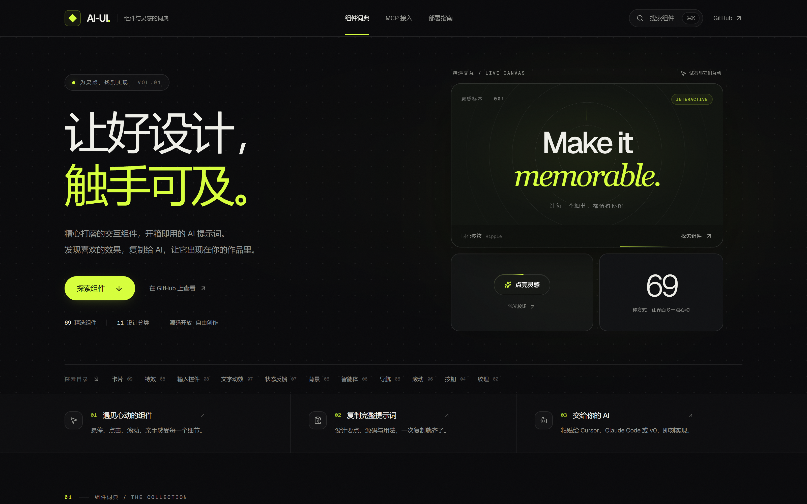
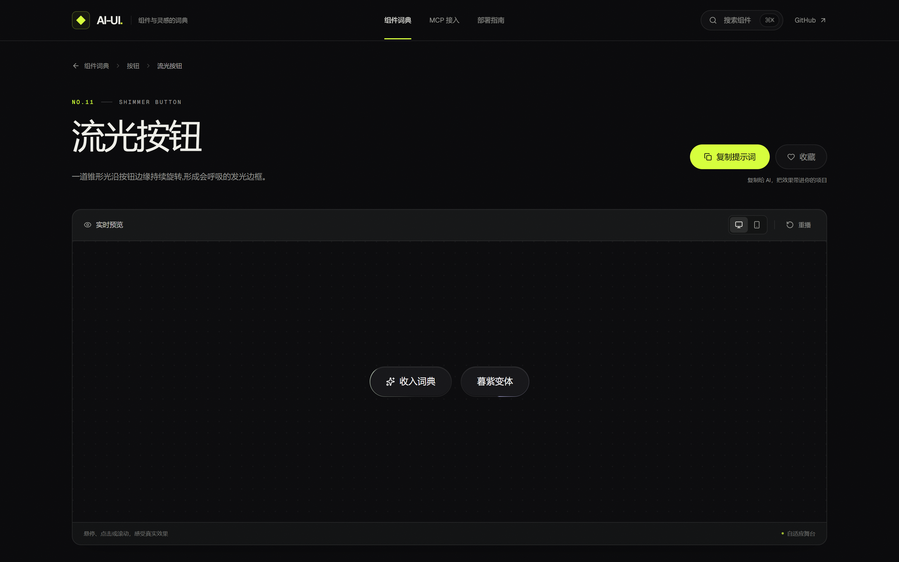
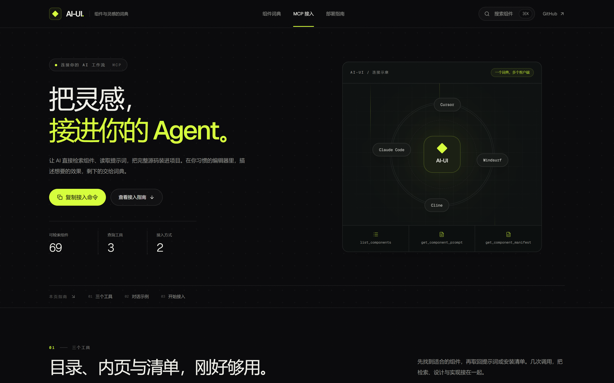

# AI-UI · 前端组件词典

> 让好设计,触手可及。

AI-UI 是一本面向 **AI Vibe Coding** 的前端组件词典:每个条目都是真实运行、可交互的组件,并附带一份完整提示词——目标、前置条件、设计要点、源码、用法与验收标准。一键复制整段提示词,粘贴给 Claude Code、Cursor 或 v0,组件即落入你的项目。

当前收录 **69** 个条目、**11** 个分类,持续扩充。

站点为纯暗色视觉语言:近黑底色、荧光绿强调、Geist 字体;组件在统一的暗色展台中演示,并尊重 `prefers-reduced-motion`。

## 在线体验

**https://ai-ui-chenyi.vercel.app**

| 首页 | 条目详情 |
| --- | --- |
|  |  |



## 快速开始

环境要求:Node.js ≥ 22.6,包管理使用 pnpm。

```powershell
pnpm install
pnpm dev        # http://localhost:3000
pnpm verify     # 测试 + 类型检查 + 注册表校验 + 全量构建(静态导出到 out/)
```

单独执行:`pnpm test`(vitest)、`pnpm typecheck`(严格模式)、`pnpm build`(构建 + Windows 预取文件规范化)。

## 添加一个条目

只改两个文件,其余全部自动生效:

1. **组件源码** — 放到 `src/registry/components/<分类>/`,自包含,除 `clsx`、`tailwind-merge` 外只允许依赖 `motion` / `lucide-react`;
2. **注册条目** — 在 `src/registry/entries/<分类>.tsx` 中追加一条 `RegistryEntry`(slug、名称、描述、设计意图、依赖、源文件路径、集成示例、预览节点)。

页面、画廊、详情、⌘K 搜索、`/llms.txt`、`/api/prompt/{slug}`、MCP 服务器三个工具与注册表完整性测试都会随之自动更新。

## 技术栈

Next.js 16(App Router,`output: "export"` 全静态)· React 19 · TypeScript 严格模式 · Tailwind CSS v4 · motion · shiki · lucide-react · geist · vitest · pnpm。

## 给 AI 的接口

- `GET /llms.txt` — 词典总目录(相对路径,任何域名下都可用);
- `GET /api/prompt/{slug}` — 直接返回某条目的完整提示词(Markdown),`curl` 或 AI 代理都能拉取;
- `GET /api/registry/{slug}` — 机器可读的安装清单(JSON):目标文件路径、完整源码、依赖列表、集成示例与提示词;
- **MCP 服务器** — 本地 stdio 与远程 streamable-http 两种传输,AI 客户端可直接查询词典(见下文)。

构建后以上均为纯静态文件,可在 `out/` 中找到;把它们部署到任意静态托管,接口即生效。

## CLI 安装器

不想复制粘贴?CLI 直接把组件装进你的项目(零依赖,Node ≥ 18):

```bash
pnpm ai-ui list                       # 列出全部条目
pnpm ai-ui search 极光                 # 关键词过滤
pnpm ai-ui add aurora-background --registry http://localhost:3000
```

`add` 会把源码写入 `src/components/ui/`,并打印依赖安装命令;`--registry` 指向任意部署了本词典的站点,缺省读环境变量 `AIUI_REGISTRY`。发布 npm 后(见 `cli/README.md`),其他项目可用 `npx ai-ui add <slug>` 直接安装。

## MCP 服务器

内置一个 MCP(Model Context Protocol)服务器,把整个词典暴露给 AI 客户端,提供三个工具:

- `list_components`:列出全部条目(编号、slug、中英文名、分类、描述、标签、依赖),支持按分类与关键词过滤
- `get_component_prompt`:按 slug 返回该条目的完整 AI 提示词(目标 → 前置条件 → 设计要点 → 源码 → 用法 → 验收标准)
- `get_component_manifest`:按 slug 返回机器可读的安装清单(JSON:文件路径、源码、依赖),适合代理解析后直接写入项目

```bash
pnpm mcp                                             # 本地 stdio 传输(默认)
pnpm mcp:http                                        # streamable-http,默认 http://127.0.0.1:8787/mcp
pnpm mcp:http -- --host 0.0.0.0 --port 9000          # 自定义监听地址(用于远程部署)
```

在 Claude Code 中接入:

```bash
# 本地 stdio(Windows 下用 cmd /c 包装 pnpm 的 .cmd shim)
claude mcp add ai-ui -- cmd /c pnpm mcp              # Windows
claude mcp add ai-ui -- pnpm mcp                     # macOS / Linux

# 远程 streamable-http(服务器上 clone 仓库、pnpm install、pnpm mcp:http 后)
claude mcp add --transport http ai-ui http://<host>:8787/mcp
```

Cursor、Windsurf 等 MCP 客户端同理配置。条目变动后 MCP 数据自动同步,无需任何维护。站内也有可视化指南:主导航「MCP 接入」(`/mcp`)与「部署指南」(`/docker`)两页。

## Docker

容器内同时运行静态站点(nginx 伺服 `out/`)与 MCP 服务器(streamable-http),启动后日志打印两个访问地址:

```bash
docker build -t ai-ui .
docker run -d --name ai-ui -p 3000:3000 -p 8787:8787 ai-ui
```

- 页面地址:`http://localhost:3000/`
- MCP 地址:`http://localhost:8787/mcp`(AI 客户端接入方式见上文「MCP 服务器」)
- 查看启动日志:`docker logs -f ai-ui`
- 容器内监听端口可用环境变量 `WEB_PORT` / `MCP_PORT` 覆盖,`-p` 端口映射需同步调整

## 部署

`pnpm build` 产出纯静态 `out/`,交给 Nginx、Vercel、Netlify、Cloudflare 等任意静态托管即可,无需服务端;`pnpm start` 不适用于此导出模式。需要站点与 MCP 服务器一起跑时,直接用上面的 Docker 镜像(内含 nginx 静态服务配置)。部署前在 `src/lib/site.ts` 中替换 `url` 与 `github` 占位符,部署完成后把站点地址填回顶部「在线体验」。

## 许可证
MIT。
